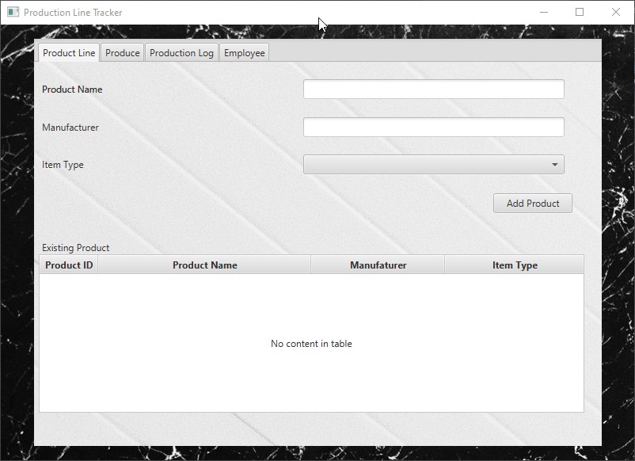
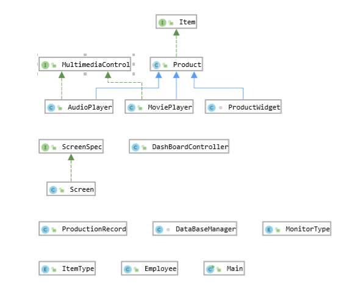
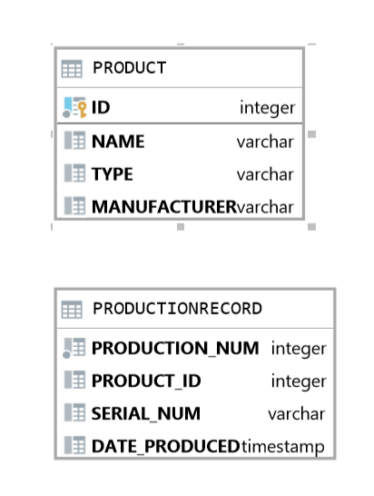

# Production Line Tracker  
**Overview:**
This project was made to resolve an issue for a hypothetical production facility to make it so that they can add a new product into their database and record its production onto a production log. Without this software, workers for the hypothetical company are forced to physically write down what is produced in a log book. I developed this program as the final project for my COP 3003 course (Object Oriented Programming) and to show boat the skills I have gained throughout the semester to potential employers. When I began development, my experience level was not the greatest, however spending hours and hours a week on this project helped me learn invaluable information about object oriented programming as a whole. 
## Author  

***Stephen Aranda***


## Demonstration  
    
## Documentation  
 [https://stephenaranda24.github.io/ProductionLineTracker/](https://stephenaranda24.github.io/ProductionLineTracker/)
  
## Diagrams  
  Class Diagram:
    
   
   Production Database Visualization:
    
  
## Development Sprints  
  
  
Sprint 1  
  
_Starting the Project_  
  

**Week 1**

-   Create JavaFX project. See [IntelliJ](https://sites.google.com/site/profvanselow/software/intellij?authuser=0) page and [IntelliJ Help](https://www.google.com/url?q=https%3A%2F%2Fwww.jetbrains.com%2Fhelp%2Fidea%2Fpreparing-for-javafx-application-development.html&sa=D&sntz=1&usg=AFQjCNGfhsMWgBGucMqbhHbov50HxK9IPA)
-   Share to **private** repository on GitHub. See [GitHub](https://sites.google.com/site/profvanselow/programming/github?authuser=0) page.
-   Create README. Details in Documentation Expectations at bottom of page.

**Week 2**

-   Add a tab view with three tabs: Product Line, Produce, and Production Log
-   Add a CSS file with some code [Reference](https://www.google.com/url?q=https%3A%2F%2Fdocs.oracle.com%2Fjavafx%2F2%2Fapi%2Fjavafx%2Fscene%2Fdoc-files%2Fcssref.html&sa=D&sntz=1&usg=AFQjCNHwozleprI88eJmJ_g5YCFMQ7fETA) [Tutorial](https://www.google.com/url?q=https%3A%2F%2Fwww.callicoder.com%2Fjavafx-css-tutorial%2F&sa=D&sntz=1&usg=AFQjCNEbUK2NN76xn_DGRHacTF6avg3chg)
-   Quality expectations: see bottom of page
-   Style expectations: see bottom of page
-   Documentation expectations: see bottom of page

**Week 3**

-   In the Product Line tab
    -   In the AnchorPane
        -   Add a 2x3 GridPane
            -   Add a Label and text field for Product Name in row 0, columns 0 and 1
            -   Add a Label and text field for Manufacturer in row 1, columns 0 and 1
            -   Add a Label and ChoiceBox for Item Type in row 2, columns 0 and 1
        -   Add a Button that says Add Product
            -   Add an event handler to the button click event. For now, just have it print to the console (System.out.println)
        -   Add a Label and a Table View for Existing Products
-   In the Produce tab
    -   In the AnchorPane
        -   Add a Label and ListView for Choose Product
        -   Add a Label and ComboBox (data type String) for Choose Quantity
        -   Add a Button that says Record Production
            -   For now, just have the button print to the console (System.out.println)
-   In the Production Log tab
    -   In the AnchorPane
        -   Add a TextArea

**Week 4**

-   Install database software if necessary
-   Create database in a res folder at same level as src folder
    -   Similar to...

```
create table Product
```

```
(
```

```
  id int auto_increment,
```

```
  name varchar,
```

```
  type varchar,
```

```
  manufacturer varchar
```

```
);
```

  

```
create unique index Product_id_uindex
```

```
  on Product (id);
```

  

```
alter table Product
```

```
  add constraint Product_pk
```

```
    primary key (id);
```

  

```
create table ProductionRecord
```

```
(
```

```
 production_num int auto_increment,
```

```
 product_id int,
```

```
 serial_num varchar,
```

```
 date_produced datetime
```

```
);
```

-   Connect to database
    -   To make your program more portable, copy the H2 driver jar file from its install location (likely Program Files (x86) H2 bin), paste it into your res folder, and set this location in the IntelliJ Project Structure (Modules -> Dependencies).
    -   You will get a FindBugs error for not having a password or including the password. Eventually you will retrieve the password from another file but you don't need to worry about this for now.
-   Make sure to commit and push your res folder to the remote repository.

**Week 5**

-   Use a controller for almost all code.
-   In the Product Line tab, for the Add Product button event handler, add code to insert a product into the database
    -   As an incremental step for testing, you can hard code this statement `INSERT INTO Product(type, manufacturer, name) VALUES ( 'AUDIO', 'Apple', 'iPod' );` See [JDBC - Insert Records Example](https://www.google.com/url?q=https%3A%2F%2Fwww.tutorialspoint.com%2Fjdbc%2Fjdbc-insert-records.htm&sa=D&sntz=1&usg=AFQjCNHuTo0mo6fnSqkICMWOAf1_-YINHQ)
    -   Once that works, build the sql statement by getting the values from the user interface.
    -   To avoid a FindBugs error, use a Prepared Statement. See [JDBC PreparedStatement](http://www.google.com/url?q=http%3A%2F%2Ftutorials.jenkov.com%2Fjdbc%2Fpreparedstatement.html&sa=D&sntz=1&usg=AFQjCNHudvfsvi60EPJ3NYo9vrUTh9wA1g)
    -   For now, every time a product is added to the database, output the full list of products to the console.
-   In the Produce tab, for the ComboBox
    -   Populate with values 1-10 in an [_initialize_ method](https://www.google.com/url?q=https%3A%2F%2Fdocs.oracle.com%2Fjavase%2F8%2Fjavafx%2Fapi%2Fjavafx%2Ffxml%2Fdoc-files%2Fintroduction_to_fxml.html%23controllers&sa=D&sntz=1&usg=AFQjCNG4hDHXzG52UWyZa9Qo9_EznSi24Q) in the Controller
    -   To allow the users to enter other values in the combobox, call the method `setEditable(true);`
    -   To show a default value, call the method `getSelectionModel().selectFirst();`
-   Prepare for submission 
##   
Sprint 2  
_OOP_

**Week 6 Enum, Interface, Abstract Class**

**Issue 1 - Product**

All items will have a pre-set type. Currently there are 4 types. Create an **enum** called ItemType that will store the following information:

_Type Code_

Audio AU

Visual VI

AudioMobile AM

VisualMobile VM

-   See [Enum Types](https://www.google.com/url?q=https%3A%2F%2Fdocs.oracle.com%2Fjavase%2Ftutorial%2Fjava%2FjavaOO%2Fenum.html&sa=D&sntz=1&usg=AFQjCNEqSBXgT_50iDGl7XnYvKFMBKDmRQ) The Java™ Tutorials
-   In the Product Line tab
    -   Fill the ChoiceBox with the types. You can use an enhanced for loop or addAll. All the constants of an enum type can be obtained by calling the implicit public static T[] values() method.
    -   Update your code to insert a product to use the choicebox selected item.

Create an **interface** called Item that will force all classes to implement the following functions:

-   A method getId that would return an int
-   A method setName that would have one String parameter
-   A method getName that would return a String
-   A method setManufacturer that would have one String parameter
-   A method getManufacturer that would return a String
-   See [Java - Interfaces](https://www.google.com/url?q=https%3A%2F%2Fwww.tutorialspoint.com%2Fjava%2Fjava_interfaces.htm&sa=D&sntz=1&usg=AFQjCNFgbby7R0aifb91_APeXmoW4s7HqA) tutorialspoint

Create an **abstract type** called Product that will implement the Item interface. Product will implement the basic functionality that all items on a production line should have. Add the following fields to Product

-   int id
-   String type
-   String manufacturer
-   String name

Complete the methods from the interface Item.

Add a constructor that will take in the name, manufacturer, and type of the product and set them to the field variables.

Add a toString method that will return the following: (example data shown).

```
Name: iPod
```

```
Manufacturer: Apple
```

```
Type: AM
```

To test the Product class, temporarily create a Widget class that extends Product. Store a created Widget object to the database and a productLine collection.

**Week 7 Inheritance**

**Issue 2 - AudioPlayer**

**MultimediaControl**

All of the items on this production line will have basic media controls. Create an interface called MultimediaControl that will define the following methods which don't need to return anything.

-   play()
-   stop()
-   previous()
-   next();

**AudioPlayer**

We require a concrete class that will allow us to capture the details of an audio player. Create a class called AudioPlayer that is a subclass of Product and implements the MultimediaControl interface.

The class will have 2 fields

-   String supportedAudioFormats
-   String supportedPlaylistFormats

Create a constructor that will take in 4 parameters – name, manufacturer, supportedAudioFormats, and supportedPlaylistFormats.

The constructor should call its parent's constructor and also setup the media type to AUDIO.

Implement the methods from the MultimediaControl interface by simply writing the action to the console.

E.g. in play `System.out.println("Playing");` Normally we would have code that would instruct the media player to play, but we will simply display a message.

Create a toString method that will display the superclass's toString method, but also add rows for supportedAudioFormats and supportedPlaylistFormats.

**Week 8 Polymorphism**

**Issue 3 - MultimediaControl**

**MonitorType**

The production facility will also create portable movie players. The main difference between these and the audio players is that they contain screens. Create an enum called MonitorType that will store

Type

LCD

LED

**ScreenSpec**

Create an interface called ScreenSpec. This will define 3 methods:

-   public String getResolution();
-   public int getRefreshRate();
-   public int getResponseTime();

**Screen**

Create a class called Screen that implements ScreenSpec. Add three fields

-   String resolution
-   int refreshrate
-   int responsetime

Complete the methods from the ScreenSpec interface.

Add a toString method that will return the details of the 3 fields in the same format as the Product class.

**MoviePlayer**

Create a class called MoviePlayer that extends Product and implements MultimediaControl.

Add 2 fields to this class called screen and monitorType and assign appropriate types to them.

Create a constructor that accepts the name, manufacturer, a screen, and a monitor type. The constructor can set the item type to VISUAL.

Complete the methods from the MultimediaControl interface in a similar fashion to the AudioPlayer.

Create a toString method that calls the Product toString and displays the monitor and the screen details.

**MultimediaControl**

The audio players and the movie players share the same control interface on the physical devices. The control interface does not care if the device is a video player or an audio player. Below is a driver that will demonstrate that any class that implements the MultimediaControl Interface would be able to be instantiated and use its methods used no matter if it was an audio or movie player.

**GUI Update:**

-   Demonstrate this functionality in your user interface. For example, you could use the code below and call testMultimedia in your initialize method or you could do something more elaborate in the GUI.

```
  public static void testMultimedia() {
```

```
    AudioPlayer newAudioProduct = new AudioPlayer("DP-X1A", "Onkyo",
```

```
        "DSD/FLAC/ALAC/WAV/AIFF/MQA/Ogg-Vorbis/MP3/AAC", "M3U/PLS/WPL");
```

```
    Screen newScreen = new Screen("720x480", 40, 22);
```

```
    MoviePlayer newMovieProduct = new MoviePlayer("DBPOWER MK101", "OracleProduction", newScreen,
```

```
        MonitorType.LCD);
```

```
    ArrayList<MultimediaControl> productList = new ArrayList<MultimediaControl>();
```

```
    productList.add(newAudioProduct);
```

```
    productList.add(newMovieProduct);
```

```
    for (MultimediaControl p : productList) {
```

```
      System.out.println(p);
```

```
      p.play();
```

```
      p.stop();
```

```
      p.next();
```

```
      p.previous();
```

```
    }
```

```
  }
```

**Week 9 Polymorphism**

**Issue 4 - ProductionRecord**

Create a ProductionRecord class with int fields for productionNumber (this will be unique for every item produced and get auto incremented by the database), an int field for productID (to correspond to the productID from the Product table / class), String field for serialNumber, and a field for the dateProduced that is type Date (from java.util).

Create accessors and mutators for all fields.

Make one constructor that just has a parameter for the productID. This will be the constructor called when the user records production from the user interface.

In this constructor,

-   Set the productionNumber to 0 (because the database will end up auto-incrementing).
-   Set the serialNumber to "0" for now.
-   Set the date to the current date using new Date().

Create an overloaded constructor to use when creating ProductionRecord objects from the database. This constructor needs parameters for all fields.

Override toString to return a string in the format "Prod. Num: 0 Product ID: 0 Serial Num: 0 Date: Mon Oct 14 10:29:48 UTC 2019"

Display the production record in the TextArea on the Production Log tab.

Security / FindBugs tip: [Defensive copying](http://www.google.com/url?q=http%3A%2F%2Fwww.javapractices.com%2Ftopic%2FTopicAction.do%3FId%3D15&sa=D&sntz=1&usg=AFQjCNFz5mwRPjotdMVuv8z0xfhycnM0Rg)

**Week 10 Encapsulation**

**Issue 5 - Production enhancement**

Add the ability for the program to generate a unique serial number for each produced product.

-   Overload the ProductionRecord constructor to accept a Product and an int which holds the count of the number of items of its type that have been created. (You can write the code to generate the count later.)
-   Set the serialNumber to start with the first three letters of the Manufacturer name, then the two letter ItemType code, then five digits (with leading 0s if necessary) that are unique and sequential for the item type. The entire Serial Number should be programmatically created and assigned.
-   Optional (for now) challenge: Show the product name instead of the product ID in the TextArea on the Production Log tab.

**Week 11 Lists and ArrayLists**

**Issue 6 - TableView**

Show all Products in the Product Line tab TableView. See [http://tutorials.jenkov.com/javafx/tableview.html](http://www.google.com/url?q=http%3A%2F%2Ftutorials.jenkov.com%2Fjavafx%2Ftableview.html&sa=D&sntz=1&usg=AFQjCNHlI4bvxrGb2-5iyo8fTrFug9QceQ) and [TableViewData sample program](https://www.google.com/url?q=https%3A%2F%2Fgithub.com%2Fprofvanselow%2FTableViewData&sa=D&sntz=1&usg=AFQjCNE-kK-F_6R2GWHSJXBM14C5JTyi_Q).

-   Create an ObservableList named _productLine_ to hold all of the Products that can be produced. For now, when the Add Product button is clicked, add to this list.
-   Set the items of the TableView to the ObservableList
    -   You can do this in a `setupProductLineTable` that also sets the columns and does the setCellValueFactory

Show all Products in the Produce tab ListView.

-   Use the selected item from the ListView as the item used to record production.

Show the production log in the Production Log tab TextArea.
  
##   
Sprint 3  
_Full database integration and enhancements_

**Week 12 Lambda Expressions**

**Issue 7 - Compare Products and Full Database Integration**

Make sure the H2 driver jar file (usually located in Program Files (x86) H2 bin) is copied into your res folder and that location is set in the IntelliJ Project Structure (Modules -> Dependencies).

Controller _initialize_ method should do things that you want to happen once when the program starts:

1.  define the ObservableList (it can be declared at class level)
2.  call setupProductLineTable
3.  associate the ObservableList with the Product Line ListView
4.  call loadProductList
5.  call loadProductionLog

Add Product button should:

1.  insert added product into database
2.  call _loadProductList_

loadProductList method should:

1.  Create Product objects from the Product database table and add them to the productLine ObservableList (which will automatically update the Product Line ListView).
2.  [Sample code to read from a database, create an object, and save to list](https://sites.google.com/site/profvanselow/course/cop-3003/bike-project?authuser=0)

Record Production button should:

1.  Get the selected product from the Product Line ListView and the quantity from the comboBox.
2.  Create an ArrayList of ProductionRecord objects named productionRun.
3.  Send the productionRun to an addToProductionDB method. (Tip: use a TimeStamp object for the date)
4.  call loadProductionLog
5.  call showProduction

showProduction should:

1.  populate the TextArea on the Production Log tab with the information from the productionLog, replacing the productId with the product name, with one line for each product produced

The addToProductionDB method should:

1.  Loop through the productionRun, inserting productionRecord object information into the ProductionRecord database table.

The loadProductionLog method should:

1.  Create ProductionRecord objects from the records in the ProductionRecord database table.
2.  Populate the productionLog ArrayList
3.  call showProduction

**Week 13 Strings, Regular Expressions**

**Issue 8**

Set a database password and read the password from a file.

The program is required to create an audit trail of the production line so that it records which employee recorded production. To accomplish this you will need to create a class and tab named Employee that will allow the user to input their full name and then create a user id of their first name, a period, and then their surname, an email address of their first initial and last name.

The class will have 4 fields

-   StringBuilder name;
-   String username;
-   String password;
-   String email;

The class will have the following methods defined:

-   private void setUsername
-   private boolean checkName
-   private void setEmail
-   private boolean  isValidPassword

The constructor will accept a String for name (firstname and surname) and String for password.

The constructor will call checkName to check if the name contains a space. If it does, it will call setUsername and setEmail, passing the name in to both. If it doesn't contain a space, set the username to "default" and the email to "[user@oracleacademy.Test](mailto:user@oracleacademy.Test)"

setUsername will set the username field to the first initial of the first name and then the last name, all lowercase.

setEmail will set the email field to the first name, then a period, then the last name (all lowercase) followed by @oracleacademy.Test

The constructor will call isValidPassword. If the password is valid (containing a lowercase letter, uppercase letter, and a special character) the password field gets set to the supplied password. If the password is invalid, the password field gets set to "pw".

Overload toString to produce:

```
Employee Details
```

```
Name : Tim Lee
```

```
Username : tlee
```

```
Email : tim.lee@oracleacademy.Test
```

```
Initial Password : aBcd!
```

**Week 14 Recursion, Modules**

**Issue 9**

To ensure that sensitive information is not leaked it is important that the information saved to file is encoded. To meet these regulations you need to add a method that will reverse the order of the text stored for the database password. This should be done recursively using a method named reverseString().

The following new methods have to be defined:

-   public String reverseString(String pw)

**Week 15 Quality Review and Deployment**

**Issue 10**

Make enhancements related to [Human User Factors](https://sites.google.com/site/profvanselow/programming/human-factors?authuser=0) including Input and Output, Error Messages, and Software Robustness. Program should gracefully handle conditions like empty textboxes, strings input instead of numbers, missing database, missing jar, etc.
  
## Built With  
  This program was made using the IntelliJ IDE which is the one I felt the most comfortable using. Through IntelliJ, I was able to extract a class diagram along with creating this readMe file. Another software used was SceneBuilder for developing the FXML file for the JavaFX program.   
## Key Programming Concepts Utilized
This program utilizes interfaces, enum classes, concrete classes, and abstract classes while integrating everything with a fully functional database. Everything is written in an object oriented manner, to make the code to be much cleaner and to utilize Java in its most efficient manner.
